# 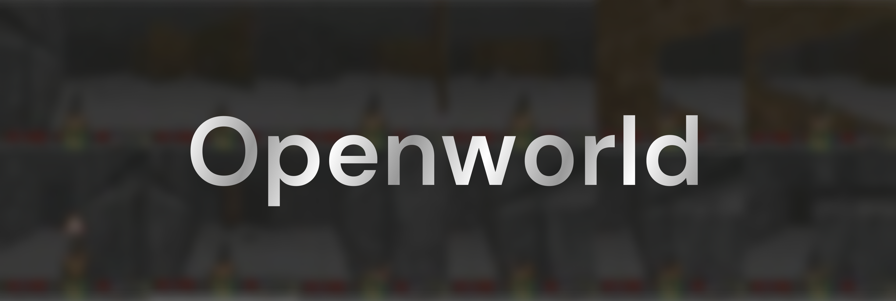

  <a href="#about">About</a> &nbsp;&bull;&nbsp;
  <a href="#architecture">Architecture</a> &nbsp;&bull;&nbsp;
  <a href="#training">Training</a> &nbsp;&bull;&nbsp;
  <a href="#inference">Inference</a> &nbsp;&bull;&nbsp;

 

  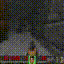

# 💡 About

Openworld is an open-source transformer world model based heavily on Google's original [Genie paper](https://arxiv.org/abs/2402.15391). It was trained on data gathered from the VizDoom library, and can run action-conditioned gameplay inference on a single high-end GPU. 

There are two versions of the model within this repository; Openworld-10M and Openworld-28M. the 10 million parameter model was trained on the vizdoom-takecover environment with only 3 actions, and the 28 million parameter model was trained on vizdoom-deathmatch, a much more complex environment with 7 actions.

## Motivations

When I first came across the demo for [Genie 3](https://deepmind.google/models/genie/), that was when I truly realized that generative AI had the potential to accurately model the dynamics of the real world, rather than being just a tool for making funny Will Smith videos. My goal with this project was, first of all, to learn as much as I could about a new frontier of AI - world models. On top of that, I also wanted to share my learnings  with other people interested in the same things, so I've created a write-up on the architecture and techniques I used.

# 🏛️ Architecture

- [Introduction](#introduction)
- [Video Tokenizer](#video-tokenizer)
- [Latent Action Model](#latent-action-model)
- [Dynamics Model](#dynamics-model)

## Introduction

I would like to preface this by saying, this writeup should be supplementary to the original papers; I would highly highly recommend understanding all the individual research first and fore-most. Genie (and thereby Openworld) is broken into 3 seperate models; the video tokenizer, the latent action model, and the dynamics model.

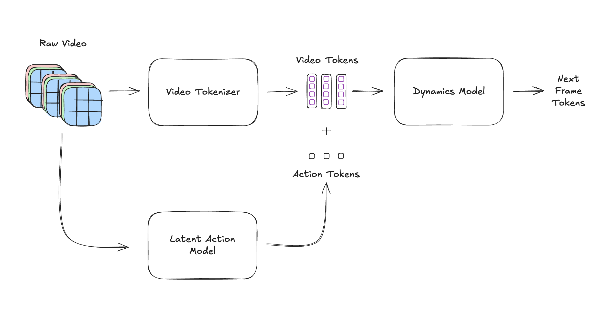

The Video Tokenizer is responsible for converting raw video into what are called latent tokens; compressed, low-dimensional representations of data. The Dynamics Model takes these latent tokens, alongside action tokens, and generates a set of latent tokens representing the next frame. 

How does it get these action tokens? In training, the Latent Action Model takes raw video and learns to generate action tokens, representing some meaningful change between previous latents and the next latents. The Dynamics Model then conditions its generation on these tokens, teaching the model what kinds of actions with what kinds of previous latents lead to what kinds of future latents. Before we dive into the architecture of these models, there are some concepts I'd like to introduce first:

### Spatio-Temporal Transformer

This transformer architecture is the bread and butter of this world model (note that for this section, a basic understanding of transformers is a pre-requisite). It consists of a chain of spatio-temporal transformer blocks. Each block contains a spatial attention block, a temporal attention block, and then a feed-forward layer. As described in the Genie paper, the spatial attention block attends over all patch tokens within a frame. The temporal attention block then attends over all patch tokens in "tubelets" through time (IE, tokens within the same spatial location, through all frames in time). Note that temporal attention is masked, whereas spatial attention is not.

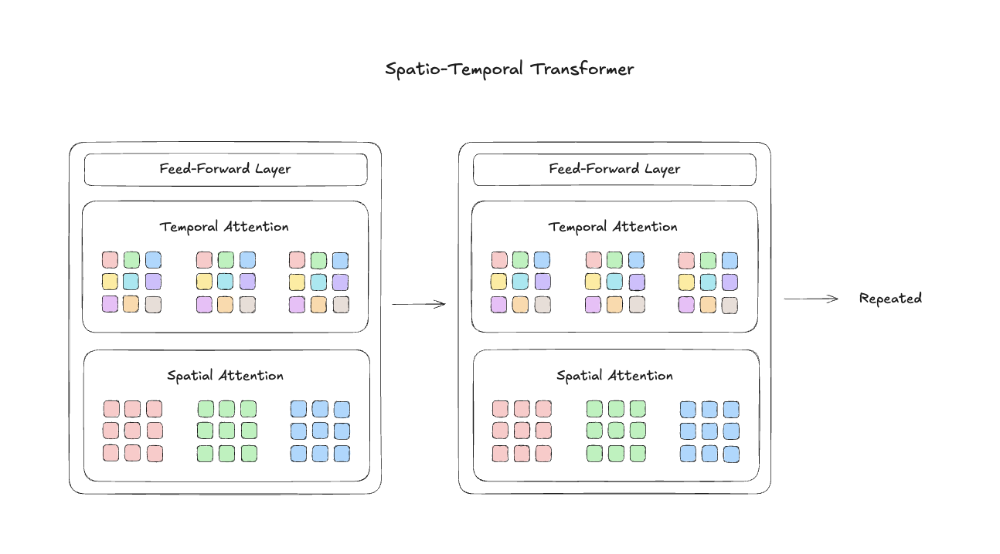

A lot of the finer details are ommitted from this diagram that I will briefly go over. The FFN layer uses a SwiGLU activation. At first I tried GeLU, and later switched to SwiGLU since it seems to perform better in LLMs. Note that each attention block implements standard Multi-Headed Attention (MHA). We also employ residual connections on the attention blocks and the FFN block, which is SoTA for transformers. For layer norm, we have two options. For usecases which don't require conditioning, we use RMSNorm. For the latent action model and the dynamics model, which need to condition generation on action tokens, we use AdaLN.

I recommend checking out [this](https://arxiv.org/abs/2102.05095) paper, which describes that divided self attention performs better in video classification tasks. This was likely the basis for the spatio-temporal transformer.

### Finite Scalar Quantization

Finite Scalar Quantization (FSQ) is a technique for quantizing vectors. I'd like to thank [Anand Majmudar](https://x.com/Almondgodd/status/1971314294517350533) and his very cool and similar project for introducing me to this concept. This is such a cool and simple algorithm which made my life a lot easier.

Essentially, Genie works with quantized latents (vectors). They utilized an algorithm called the Vector-Quantized Variational Auto-Encoder (VQ-VAE). This approach maintains a codebook of vectors. To quantize a given input vector, we simply return the closest codebook vector. These codebook vectors are also learned; they are updated via some algorithm (gradient descent, exponential moving average). 

The problem with this algorithm is that it suffers from something called [codebook collapse](https://machinelearning.wtf/terms/codebook-collapse/), where only a small fraction of codebook vectors are actually utilized (due to the nature of pushing vectors around during training). For example, some vectors may be pushed into regions that the inputs do not visit.

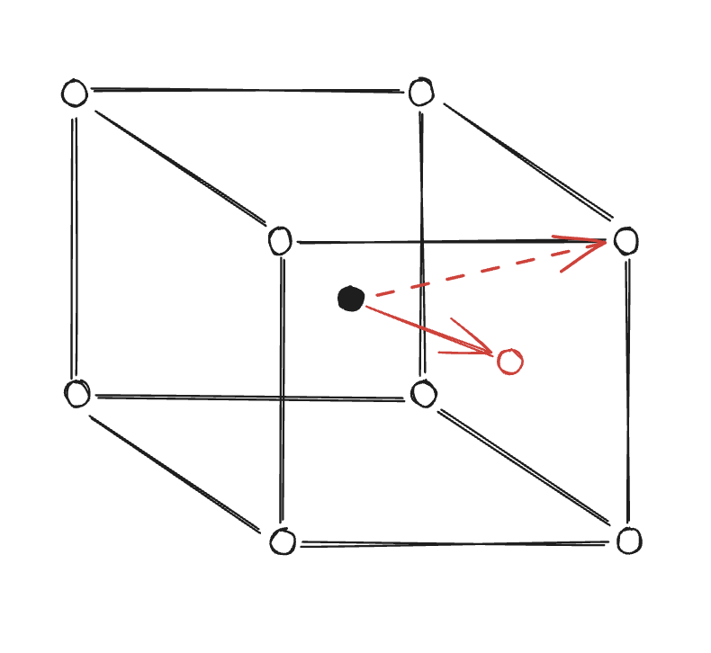

FSQ solves that by re-thinking the entire quantization space. Instead of learned vectors, FSQ codebook vectors are essentially evenly-spaced points along the edges of a hypercube. We quantize in a similar fashion; essentially snapping an input vector to one of these points (scaled within -1 to 1). The reason this works is that, since the vectors are evenly spaced and don't move around, they all have an equal chance of being utilized. With a latent vector dimension of 3 and 2 bins, this quantization space resembles the corners of a cube, as shown above.

Check out the FSQ paper [here](https://arxiv.org/abs/2309.15505).

### Embedding

How do we actually feed our images into the tokenizer and action model? We need some way of embedding images into sequences of tokens that our transformers can actually work with. The answer is patch embeddings. We split a video into a sequence of individual frames. For each frame, we divide it into patches. For each patch, we flatten all the R, G, and B values into a single vector (each patch goes from shape (P, P, 3) into (P * P * 3)). 

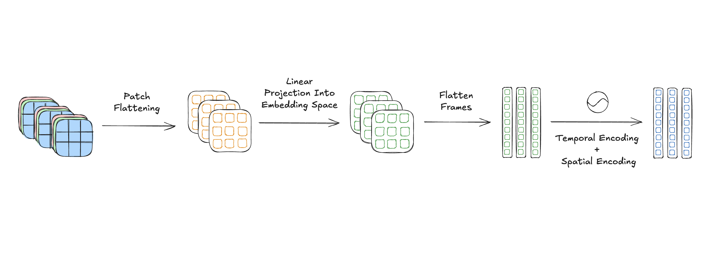

Next, we project all of these patch vectors into the embedding space (the dimensionality of the actual embedding tokens our transformer will work with). This is done through a single linear layer, which is effectively a matrix multiplication across all patch vectors in order to convert them into tokens (dimensionality P * P * 3 -> embed_dim).

Finally, we need some way to encode *position* into each token. Just like in a sentence, a token in one position has a different contextual meaning than if it were somewhere else. To achieve this, we add 3 positional encoding vectors onto each patch token that encodes where that patch is in terms of time, X, and Y position. I won't go too into detail for positional encoding, since there is a great resource I found [here](https://huggingface.co/blog/designing-positional-encoding).

## Video Tokenizer

The video tokenizer is fundamentally an auto-encoder which includes an FSQ step in between the encoder and decoder. It works by compressing (encoding) video into a latent representation, then trying to decode that into the same video again, learning to preserve the most useful information within its latent.

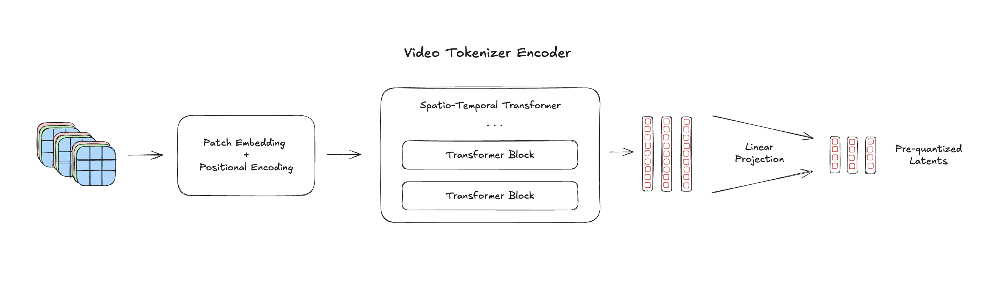

The encoder takes raw video, runs it through patch embedding and positional encoding blocks, and a spatio-temporal transformer. Finally, the tokens are projected down into the latent dimension, from the embedding dimension. This is where the data compression occurs.

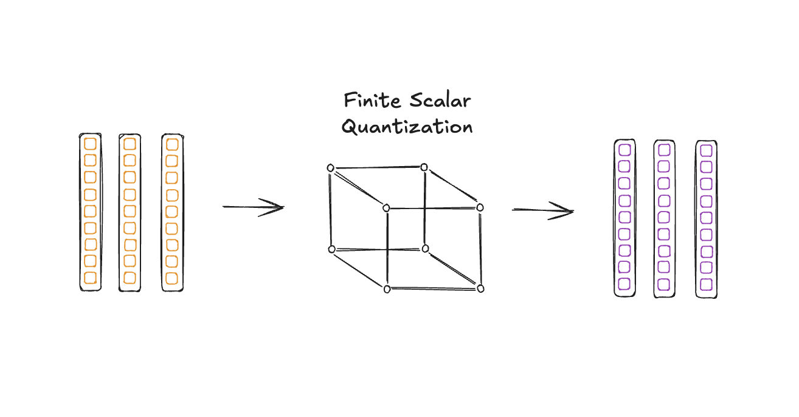

Next, we pass the pre-quantized latent through FSQ. Note that the resulting quantized latent is the video tokenizer's output, which is used by the dynamics model.

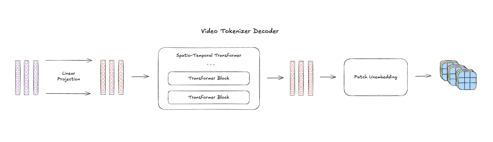

Finally, our decoder takes the quantized latents, passes it through the spatio-temporal transformer again, and then unembeds each patch back into pixel formats. In hindsight, I also could have added a positional encoding block before we pass the tokens into the spatio-temporal transformer within the decoder, but in practice the video tokenizer never struggled with its objective.

## Latent Action Model

Previously, world models that could generate action-conditioned video needed labelled/supervised data in order to train. Genie introduced the concept of using a Latent Action Model (LAM) in order to infer actions from video, allowing Genie to train on unlabelled data and massively expand its training set. This was likely instrumental in allowing Genie to be the first ever foundational world model (a model that can be generalized across diverse environments). Note that the LAM only exists to provide training signal to the dynamics model; it is discarded during inference.

The LAM is broken into two models, the encoder and decoder. It is structured similarly to an auto-encoder. The encoder is responsible for taking raw video, and producing action tokens. Each action token is some representation of the change between the previous frames and next frames. The decoder takes these actions, and alongside the previous frames, tries to reconstruct the next frame. By employing a reconstruction loss, the idea is that the LAM should encode a meaningful representation of change into each action token such that it can be used to predict the next scene.

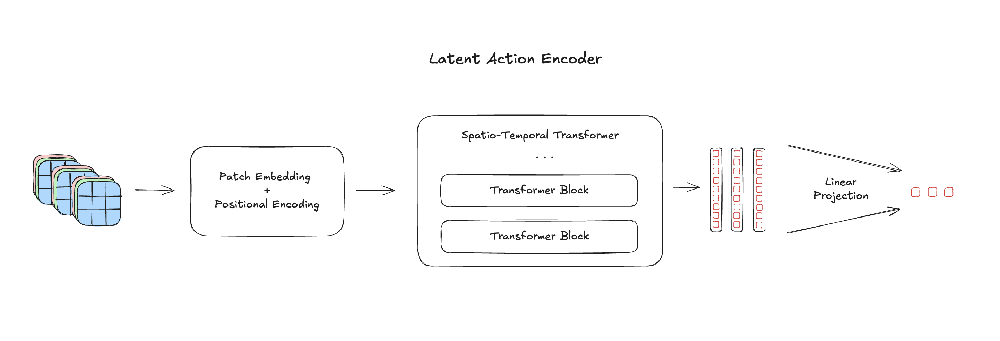

The latent action encoder is essentially the same as the encoder in our Video Tokenizer.

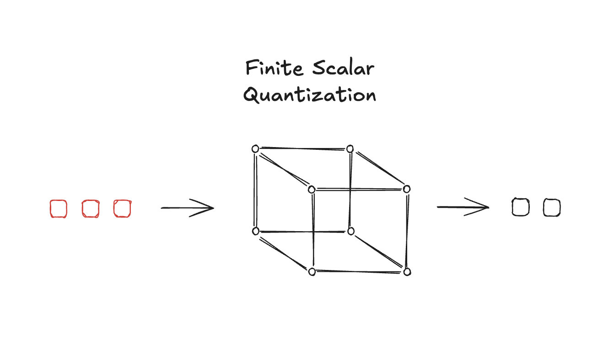

The key difference is after the quantization step. We pass the tokens through FSQ like normal, but we remove the first token, since its context comprises solely of the first token. We want token N to represent some change between frames 1 -> N-1 and frame N, so token 1 is useless to us. If there are T frames, we produce T-1 action tokens.

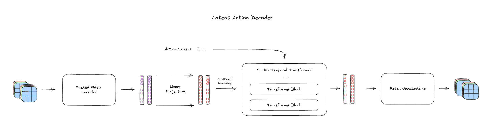

The decoder is itself very similar to an auto-encoder. The decoder first discards the last frame, and re-encodes the input using a masked version of the Video Tokenizer's encoder. The masked encoder randomly masks patch tokens in order to reduce the history signal and to try to get the decoder to pay more attention to the action tokens. After encoding the video, the latents are passed through a spatio-temporal transformer conditioned on the action tokens from the encoder. The transformer's output is then put through an unembedding process to try to reconstruct all next frames.

The decoder is given frames 1 to T-1. It also recieves T-1 actions, representing some change between frames 1 and 2, frames 2 and 3, etc. We use these to try to reconstruct frames 2 to T. The key realization here is that the spatio-temporal transformer is causal in nature; the tokens corresponding to frame t not only have access to action t for conditioning, but also *attend to all frame tokens before it*, giving it enough context to reconstruct frame t+1.

### The Problem

At first, it was very difficult to have this model produce meaningful actions at this scale (~5.5M parameters). It suffered from action collapse, meaning that it would map multiple sequences of frames to the same tokens when, in ground-truth, they were distinct actions. The issue was most likely that the historical frames were enough signal for the decoder to predict a reasonable next frame, and so it fell into a local minima and ignored signal from its own action tokens.

In order to mitigate this problem, I added a tiny classifier head which takes the action tokens, and tries to predict which action this token corresponds to. I then labelled a small portion of the data and introduced a semi-supervised cross-entropy auxillary loss on this classifier. Since the classifier is a single linear layer with essentially zero expressive power, the brunt of the work is left to the encoder in order to separate actions into distinct tokens. In practice, I achieved 90%+ action separation with as little as 10% of the data labelled. This method massively enhanced the usefulness of my LAM, while also preserving its original goal, which was to allow the model to train on vast amounts of unlabelled data. A deeper analysis of this method is detailed in the training section.

## Dynamics Model

The dynamics model is responsible for taking context frame latents and generating the next frame, conditioned on actions. However, this generation is quite different from how it's done in the LAM. The Dynamics Model uses a MaskGIT backbone. This architecture excels at a task called infilling, where it learns to generate image tokens based on the surrounding context. MaskGIT works by iteratively predicting all patch tokens at once, taking the most confident ones, inserting them into the input and unmasking, and repeating until all patch tokens are generated. Given that it's a transformer, we can also insert AdaLN to condition generation. Note that our MaskGIT architecture still employes a spatio-temporal transformer under the hood. I would highly recommend reading the [MaskGIT paper](https://arxiv.org/abs/2202.04200).

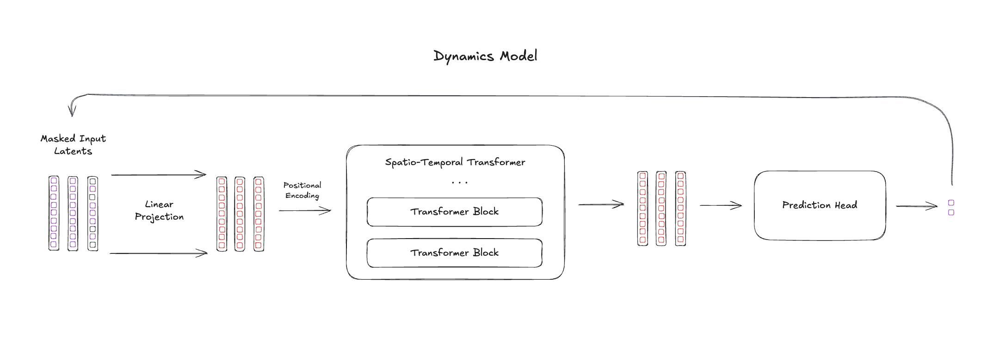

First, we take the latents provided by the Video Tokenizer. To generate the next frame, we append a completely masked frame at the end of our video. We then project our latents into the embedding dimension and pass them through the spatio-temporal transformer. The output tokens for the masked frame are then fed through a prediction head, which projects each token into a vector of dimension `size_codebook` and applies softmax. This gives each masked patch a probability distribution over all possible codebook entries.

From here, iterative decoding begins. We select the predictions with the highest confidence (i.e., the highest softmax probability), unmask those patches by replacing them with the input latent, and re-run the transformer. Each iteration, the model has more context to work with, allowing it to make increasingly informed predictions for the remaining masked patches. This process repeats until all patches in the new frame are unmasked. 

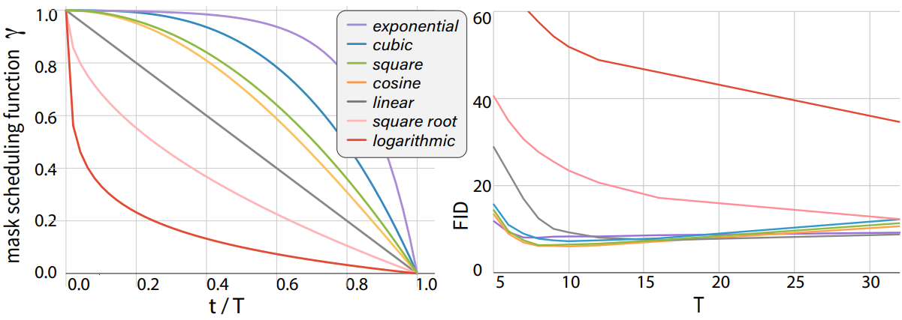

According to the MaskGIT research, generation quality is heavily influenced by the mask scheduling function, or the function that determines how much of the previously masked tokens should be unmasked at every iteration. As per the paper, we employ a cosine schedule, which unmasks few tokens at once early on, and then later on, unmasks many at a time.

# 🏋️ Training

- [Video Tokenizer](#video-tokenizer-1)
- [Latent Action Model](#latent-action-model-1)
- [Dynamics Model](#dynamics-model-1)

## Data Gathering

The vizdoom-takecover dataset had ~70k steps of gameplay, which was sampled by a random agent which would randomly have a bias to move left, right, or to not move at all in each episode. For the vizdoom-deathmatch environment, I sourced an rl implementation from this [repo](https://github.com/lkiel/rl-doom), trained the agent, and gathered about 300k rollout steps. Note that this is distinct from the deathmatch environment found [here](https://vizdoom.farama.org/environments/default/).

## Video Tokenizer

The Video Tokenizer was trained on 64x64 images with a patch size of 4, so 16 patches horizontally and vertically. We have a latent dimension of 5, with 4 bins, meaning there are 4^5 = 1024 possible codebook vectors. We employ a Mean Squared Error (MSE) loss to compare ground-truth and reconstructed frames, and a vanilla Adam optimizer. The tokenizer for both environments only needed about 1.7M parameters to achieve good convergence, corresponding to an embedding dimension of 128. I did not experiment to see if it could have been made smaller.

## Latent Action Model

The latent action model was trained on 64x64 images with a patch size of 8, so 8 patches horizontally and vertically. Given that the LAM is not used for reconstruction and only needs enough signal to distinguish actions, I hypothesized that we could increase patch size from 4 and reduce parameter count a little.

Even with the semi-supervised auxillary loss discussed earlier, the LAM struggled to provide good action seperation, and good accuracy for each action. I discovered through a rough ablation study on the vizdoom-takecover environment that, as I increased the labelled percentage, the model began to converge faster and faster. With 100% labelled, the LAM converged in ~2-3 epochs. with 50% labelled, it took 4-5 epochs. With 10% labelled, it did not converge within 20 epochs. One would think this is simply a data problem, and that the model just needed more labelled examples. However, even with 10% labelled there would be ~2k labelled examples for each of the 3 actions. 

I hypothesized that the problem lied in gradient noise, and not a lack of data. The LAM was originally trained with a batch size of 32 and predicted 15 actions per batch. In each training batch, each labelled sample gives us a single loss datapoint, and the overall supervised loss is the average of these datapoints. Let's define each individual supervised loss point as a random variable with mean $\mu$ and variance $\sigma^2$. The average loss per batch is then:

$$\bar{L} = \frac{1}{n} \sum_{i=1}^{n} L_i, \quad E(\bar{L}) = \mu, \quad \text{Var}(\bar{L}) = \frac{\sigma^2}{n}$$

With the dataset 100% labelled, we have $n = 32 \times 15 = 480$ labelled samples per batch:

$$\text{Var}(\bar{L}_{100\\%}) = \frac{\sigma^2}{480}$$

With only 10% labelled, $n = 48$:

$$\text{Var}(\bar{L}_{10\\%}) = \frac{\sigma^2}{48}$$

That's 10x the variance in our loss signal! A noisy loss leads to a noisy gradient, which tends to wander around more randomly and takes longer to converge. In order to combat this, I implemented DDP across 2 GPUs, which effectively doubles your batch size as each GPU gathers its own batch every training iteration, and averages gradients. I also doubled batch size from 32 to 64. These two improvements proved very effective and allowed the LAM to converge quickly with as little as 10% labelled samples.

## Dynamics Model

The Dynamics model was trained on 64x64 images with a patch size of 4. Since the Dynamics Model does not work with raw video, we precompute all the frame and action latents to try to save a bit of training time. In training, we do not perform iterative decoding. Rather, each sample is a collection of latents we pass to the Dynamics Model. We randomly mask the frame latents, and we task the Dynamics Model with predicting what codebook vectors should be in the masked spaces. Our loss is therefore a cross-entropy loss across all possible codebook vectors. 

We employ a Warmup-Stable-Decay (WSD) learning rate scheduler, which essentially keeps learning rate at a high and constant value for the first portion of training, then decays learning rate over the rest of the epochs. I originally had a cosine-annealing scheduler, but switched to WSD because I couldn't tell if the model was plateauing or if the learning rate had just become too small. We employ bf16 (16 bit precision instead of 32) during the forward pass in order to save memory. We also DDP across multiple GPUs to save time.

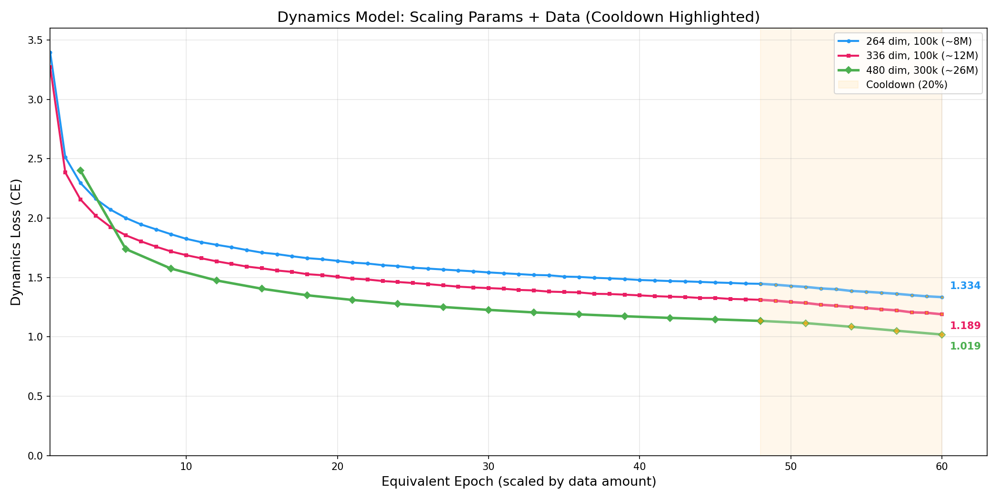

We can observe the river-valley phenomenon with WSD, where loss drops sharper during the cooldown phase. During the stable phase, learning rate is high and the model oscillates across the "valley". During cooldown, the smaller learning rate allows it to settle. Similar to the Genie paper, I observed healthy loss reductions as I scaled the model. The current 28M model isn't large enough to persist enemies within the environment, but further scaling would no doubt improve performance. Note that the first two models (8m, 12m) were trained with 60 epochs on 100k steps of gameplay, and the third dynamics model (26m) was trained with 20 epochs on 300k steps of gameplay.

# 🎮 Inference

WIP Section
